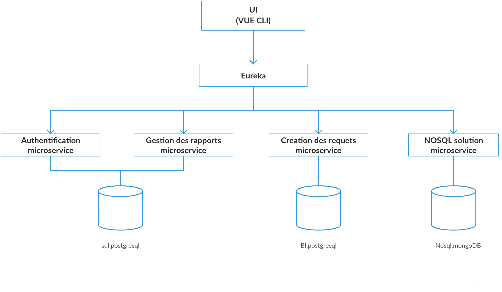

---

# Project Name: PowerBI-like Microservices Platform

## Table of Contents

- [Overview](#overview)
- [Architecture](#architecture)
- [Features](#features)
- [Technologies Used](#technologies-used)
- [Database Setup](#database-setup)
- [Microservices](#microservices)

## Overview

**PowerBI-like Microservices Platform** is an implementation of a business intelligence (BI) solution (close to Power BI) which offers society SPE a synthesized view of the performance of the company through dynamique creation of indicators, dashboards, detailed reports and multidimensional data analysis. This project mimics the functionality of PowerBI, providing advanced data analytics, visualization, and reporting capabilities in a microservices architecture.

## Architecture

This project follows a microservices architecture (Microservices implementation — Netflix stack), designed for scalability, flexibility, and robustness. The system is composed of the following core components:

- **Frontend**: Vue Js
- **Backend Services**: Multiple microservices with Spring Boot, each responsible for specific functionalities(auth ,query optimization....).
- **Databases**: 
  - **PostgreSQL**: Data warehouse for complex analytics.
  - **MySQL**: Core database to support the main application functionality.
  - **MongoDB**: Used for caching to improve performance and reduce latency.

## Features

- **Data Analytics**: Provides powerful analytics capabilities, enabling users to gain insights from large datasets. Offers tools for performing descriptive, diagnostic, predictive, and prescriptive analytics to help businesses make data-driven decisions.
- **Customizable Dashboards**: Empowers users to design personalized dashboards by adding, removing, or rearranging widgets such as charts, graphs, and tables. Supports various visualization types and filters to tailor dashboards to specific needs or preferences.
- **Real-time Data Processing**: Delivers real-time data processing to ensure users have access to the most up-to-date information. This includes streaming data analytics, live dashboards, and immediate updates for critical metrics, helping teams act quickly.
- **User Management**: eatures a comprehensive user management system that includes role-based access control (RBAC), authentication mechanisms (e.g., OAuth, LDAP), and user activity tracking. Ensures data security and tailored access for different organizational roles.
- **Report Generation**: Simplifies the creation of detailed reports with customizable templates and export options (e.g., PDF, Excel, CSV). Users can schedule automated report generation and delivery or generate them on-demand based on their chosen parameters.

## Technologies Used

- **Frontend**: Vue.js,apex.chart
- **Backend**: Spring Boot, Python,Java
- **Database**: PostgreSQL, MySQL, MongoDB
- **Caching**: MongoDB
- **ETL**: Talend Open Studio
- **Containerization**: Docker
- **APIs**: REST, JPA

## Microservices

### 1. **Authentication Microservice**

The Authentication Microservice is responsible for managing authentication and access rights, including user management and their roles.

### 2. **Report and Query Management Microservice**

The Report and Query Management Microservice is designed to handle queries and reports saved within the tool's database

### 3. **The Query Execution and Data Loading Microservice**

The Query Execution and Data Loading Microservice is the only microservice that communicates with the Data Warehouse

### 4. **The NoSQL Optimization Microservice**
The NoSQL Optimization Microservice is designed to optimize the response time of heavy queries that are reused multiple times. This solution leverages NoSQL, where the result of a query is stored in a MongoDB database.
As a result, executing a query a second time is replaced by directly retrieving its result from the MongoDB database, significantly improving efficiency and performance.

### 5. **Eureka**
When your application needs to handle increased load and you have multiple instances of each microservice, it is crucial to maintain a registry of all available instances to distribute the load among them effectively.

Eureka, developed by Netflix, fulfills this exact purpose. Once implemented, the microservice instances register themselves with the Eureka registry. To call a microservice, you simply select an instance from the list exposed by Eureka, ensuring efficient load balancing and service discovery.

---

For more details, check out the [Download the PDF](./Pfe.pdf) (In french).

# solution_BI_ELIT
 microservices BI solution
 
 
 
 
 
 
 
 
 
 
 
 
 
 
 
 
 
 
 
 
 
 

